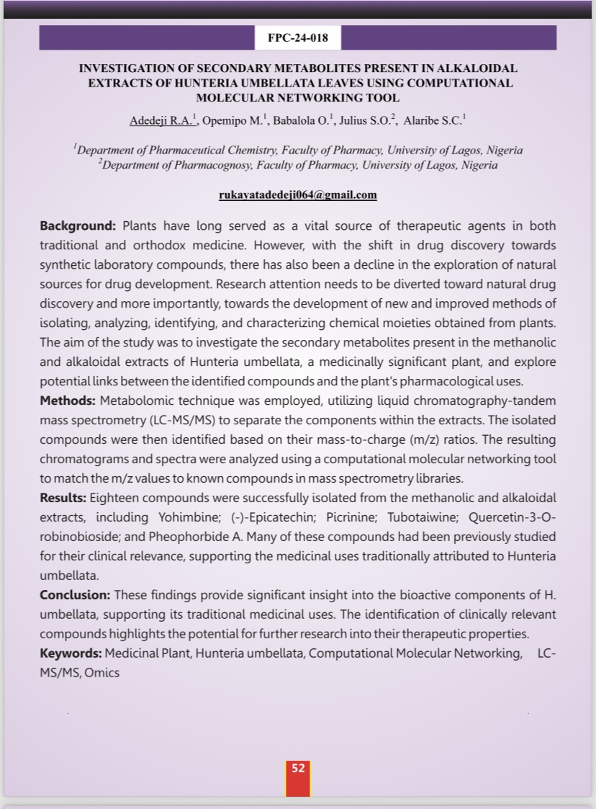

# Scientific Conferences Repository

This repository serves as a personal archive for all my scientific conference materials, including:

- **Abstracts**: Collection of abstracts submitted to various scientific conferences.
- **Presentations**: Slide decks or poster presentations delivered during conferences.
- **Certificates**: Proof of participation or recognition received from conferences and workshops.

My poster presentation at the 3rd Faculty of Pharmacy, University of Lagos

This repository is organized to keep track of my professional development and participation in scientific conferences over time. It provides easy access to all materials in one place, ensuring that they are safely stored and easily accessible when needed.
